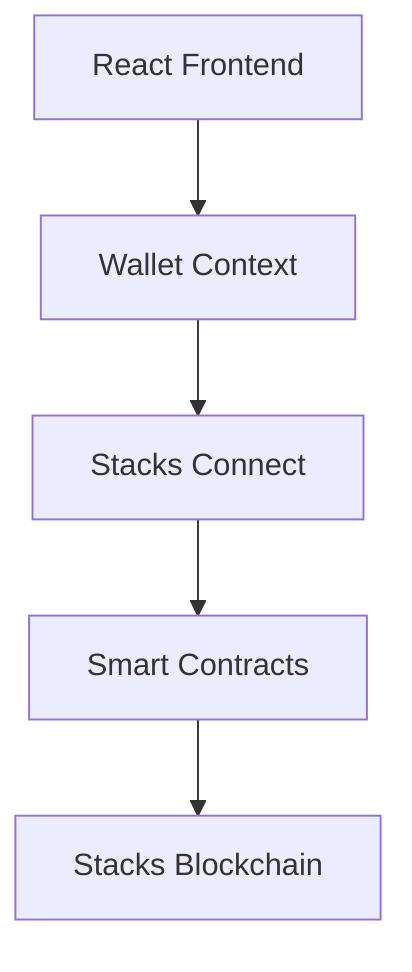

# 🎮 CoinQuest - Demo Script

## Demo Overview

This demo showcases CoinQuest's blockchain integration, wallet connectivity, and smart contract functionality. The demo is designed to highlight the seamless integration between traditional gaming and Web3 technology.

## Demo Setup

### Prerequisites
- Xverse wallet installed and connected to Stacks Testnet
- Testnet STX tokens (get from [faucet](https://explorer.stacks.co/sandbox/faucet))
- Modern web browser (Chrome, Firefox, Safari, Edge)

### Demo Environment
- **Network**: Stacks Testnet
- **Contracts**: Deployed and verified
- **Wallet**: Xverse integration active

## Demo Flow

### 1. Introduction (2 minutes)

**Welcome to CoinQuest!**

"CoinQuest is a revolutionary arcade game that combines classic gameplay with cutting-edge blockchain technology. Players collect coins, complete quests, and earn real rewards through smart contracts deployed on the Stacks blockchain."

**Key Features to Highlight:**
- 🎮 Classic arcade gameplay
- 🔗 Blockchain integration
- 🏆 Quest system with real rewards
- 💰 Token economy
- 🔐 Wallet integration

### 2. Wallet Connection Demo (3 minutes)

**Step 1: Connect Wallet**
```javascript
// Show in browser console
console.log('🔗 Connecting to Xverse wallet...');
await window.connectWallet();
```

**Expected Result:**
- Wallet connection dialog appears
- User approves connection
- Address displays in UI
- STX balance shows

**Step 2: Verify Connection**
```javascript
// Check wallet status
const status = window.getWalletStatus();
console.log('Wallet Status:', status);
```

**Demo Points:**
- Seamless wallet detection
- One-click connection
- Real-time balance display
- Address management

### 3. Contract Integration Demo (5 minutes)

**Step 1: Initialize Contracts**
```javascript
// Initialize contract integration
console.log('🔧 Initializing contract integration...');
await window.initializeContractIntegration();
```

**Step 2: Test Contract Functions**
```javascript
// Test contract integration
console.log('🧪 Testing contract integration...');
await window.testContractIntegration();
```

**Expected Output:**
```
📋 Available contracts:
  GameTokenR: ST18YM565C2RG5W8DFDT5W577YMG5QSAKVRG0MGV1.GameTokenR
  QuestReward: ST18YM565C2RG5W8DFDT5W577YMG5QSAKVRG0MGV1.QuestReward
  PlayerProf: ST18YM565C2RG5W8DFDT5W577YMG5QSAKVRG0MGV1.PlayerProf

✅ QuestReward contract found: ST18YM565C2RG5W8DFDT5W577YMG5QSAKVRG0MGV1.QuestReward
🎮 Ready for game actions:
  - Submit score: window.callStacksFinalize([score])
  - Claim reward: window.callStacksClaim([questId])
  - Buy life: window.callStacksBuyLife([])
```

**Demo Points:**
- Contract address verification
- Function availability check
- Integration status confirmation

### 4. Gameplay Demo (8 minutes)

**Step 1: Start Game**
- Click "Play" button
- Game loads and starts
- Show classic arcade gameplay

**Step 2: Collect Coins**
- Demonstrate coin collection
- Show score increasing
- Highlight smooth gameplay

**Step 3: Submit Score**
```javascript
// Submit game score
console.log('🎮 Submitting game score...');
const result = await window.callStacksFinalize([150]);
console.log('Score submitted:', result);
```

**Expected Result:**
- Transaction dialog appears
- User approves transaction
- Score stored on blockchain
- Tokens earned based on score

**Step 4: Claim Quest Reward**
```javascript
// Claim quest reward
console.log('🏆 Claiming quest reward...');
const claimResult = await window.callStacksClaim([1]);
console.log('Reward claimed:', claimResult);
```

**Expected Result:**
- Quest completion verified
- Reward tokens transferred
- Success message displayed

**Step 5: Buy Extra Life**
```javascript
// Buy extra life
console.log('💾 Buying extra life...');
const lifeResult = await window.callStacksBuyLife([]);
console.log('Life purchased:', lifeResult);
```

**Demo Points:**
- Real-time blockchain transactions
- Token rewards for gameplay
- Quest system integration
- In-game purchases with tokens

### 5. Advanced Features Demo (5 minutes)

**Step 1: Player Statistics**
```javascript
// Check player stats
const stats = await window.getWalletStatus();
console.log('Player Stats:', stats);
```

**Step 2: Contract State**
```javascript
// Debug wallet detection
window.debugWalletDetection();
```

**Step 3: Transaction History**
- Show Stacks Explorer
- Display transaction confirmations
- Highlight transparency

**Demo Points:**
- Player data persistence
- Transaction transparency
- Blockchain verification
- Decentralized data storage

### 6. Technical Deep Dive (7 minutes)

**Architecture Overview:**


**Key Technologies:**
- **Frontend**: React 18 + TypeScript
- **Blockchain**: Stacks Network
- **Contracts**: Clarity language
- **Wallet**: Xverse integration
- **Build**: Vite + modern tooling

**Smart Contract Functions:**
```clarity
;; Submit game score and earn tokens
(define-public (submit-game-score (score uint))
  ;; Updates player stats and completes quests
  ;; Mints tokens based on score
)

;; Claim quest reward
(define-public (claim-quest-reward (quest-id uint))
  ;; Transfers reward tokens to player
  ;; Marks quest as claimed
)
```

**Demo Points:**
- Modern React architecture
- Type-safe development
- Smart contract integration
- Wallet abstraction layer

### 7. Q&A and Wrap-up (5 minutes)

**Common Questions:**

**Q: How does the token economy work?**
A: Players earn tokens based on their game performance. Tokens can be used for in-game purchases or traded on exchanges.

**Q: Is this secure?**
A: Yes, all transactions are secured by the Stacks blockchain. Players control their own private keys.

**Q: What wallets are supported?**
A: Currently Xverse (primary) and Leather (Hiro). More wallets coming soon.

**Q: Can I play without a wallet?**
A: You can play the game, but you need a wallet to earn rewards and use blockchain features.

**Q: How do I get started?**
A: Install Xverse wallet, get testnet STX from the faucet, and start playing!

## Demo Scripts

### Quick Demo Commands

```javascript
// 1. Connect wallet
await window.connectWallet();

// 2. Initialize contracts
await window.initializeContractIntegration();

// 3. Test integration
await window.testContractIntegration();

// 4. Submit score
await window.callStacksFinalize([100]);

// 5. Claim reward
await window.callStacksClaim([1]);

// 6. Buy life
await window.callStacksBuyLife([]);

// 7. Check status
window.getWalletStatus();
```

### Demo Checklist

- [ ] Wallet connection working
- [ ] Contract addresses correct
- [ ] Score submission successful
- [ ] Reward claiming functional
- [ ] Life purchase working
- [ ] UI updates properly
- [ ] Error handling graceful
- [ ] Performance smooth

## Troubleshooting

### Common Issues

**Wallet Not Detected:**
```javascript
// Debug wallet detection
window.debugWalletDetection();
```

**Contract Not Found:**
```javascript
// Check contract addresses
console.log('Contracts:', {
  GameTokenR: window.wallet?.getContractId('GameTokenR'),
  QuestReward: window.wallet?.getContractId('QuestReward'),
  PlayerProf: window.wallet?.getContractId('PlayerProf')
});
```

**Transaction Failed:**
- Check wallet balance
- Verify network connection
- Ensure testnet STX available

### Demo Backup Plan

If live demo fails:
1. Show recorded demo video
2. Explain architecture with diagrams
3. Walk through code examples
4. Demonstrate wallet connection separately

## Demo Materials

### Slides
- Architecture overview
- Technology stack
- Smart contract functions
- User journey flow

### Code Examples
- Wallet connection
- Contract interaction
- Error handling
- TypeScript types

### Live Demo
- Browser-based demo
- Console commands
- Real transactions
- Interactive gameplay

## Success Metrics

### Demo Goals
- [ ] Audience understands blockchain integration
- [ ] Wallet connection demonstrated successfully
- [ ] Smart contract functions working
- [ ] Gameplay smooth and engaging
- [ ] Technical questions answered

### Follow-up Actions
- [ ] Collect feedback
- [ ] Answer technical questions
- [ ] Provide resources
- [ ] Schedule follow-up meetings

---

**Demo Duration**: 30 minutes total
**Audience**: Developers, blockchain enthusiasts, gamers
**Level**: Intermediate to Advanced
**Format**: Live demo with interactive elements
