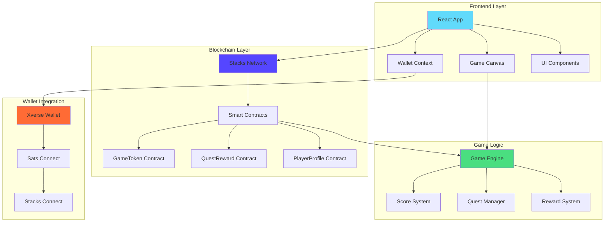
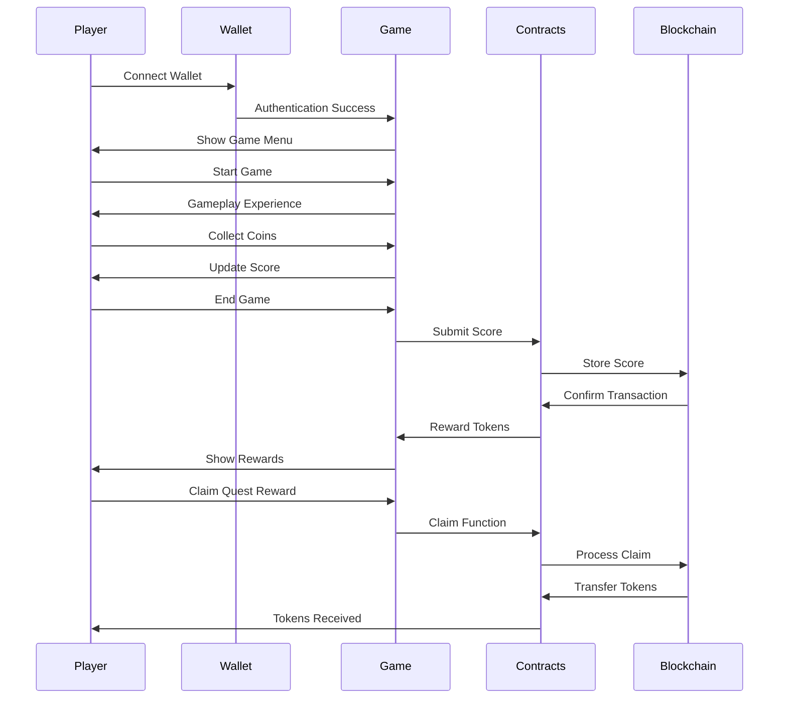
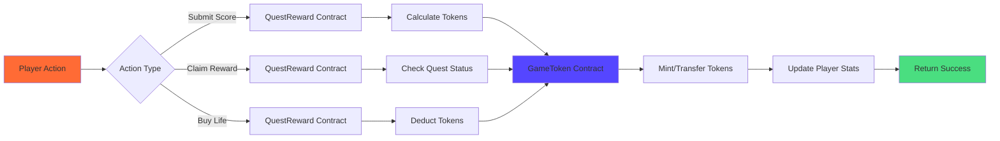

# 🎮 CoinQuest - Blockchain-Powered Arcade Game

<div align="center">


**A revolutionary arcade game that combines classic gameplay with cutting-edge blockchain technology**

[🚀 Live Demo](https://coinquest-demo.vercel.app) | [📖 Documentation](https://docs.coinquest.com) | [🎯 Play Now](https://play.coinquest.com)

</div>

---

## 🌟 Overview

CoinQuest is a next-generation arcade game that seamlessly integrates blockchain technology to create an immersive gaming experience. Players collect coins, complete quests, and earn real rewards through smart contracts deployed on the Stacks blockchain.

### ✨ Key Features

- 🎮 **Classic Arcade Gameplay** - Intuitive controls and engaging mechanics
- 🔗 **Blockchain Integration** - Real rewards through smart contracts
- 🏆 **Quest System** - Complete challenges to earn tokens
- 💰 **Token Economy** - Earn and spend in-game tokens
- 🔐 **Wallet Integration** - Connect with Xverse wallet
- 📊 **Player Profiles** - Track your progress and achievements
- 🎨 **Modern UI/UX** - Beautiful, responsive design

---

## 🏗️ Architecture

### System Architecture Diagram



### Technology Stack

| Layer | Technology | Purpose |
|-------|------------|---------|
| **Frontend** | React 18 + TypeScript | Modern UI framework |
| **Styling** | CSS3 + Modern Layout | Responsive design |
| **Blockchain** | Stacks Network | Smart contract platform |
| **Wallet** | Xverse + Sats Connect | Wallet integration |
| **Contracts** | Clarity | Smart contract language |
| **Build Tool** | Vite | Fast development server |
| **Deployment** | Clarinet | Contract deployment |

---

## 🔄 Game Flow

### Player Journey Flow



### Smart Contract Interaction Flow



---

## 📁 Project Structure

```
coinQuest-react/
├── 📁 public/                 # Static assets
│   ├── 📁 assets/             # Game assets (sprites, sounds, etc.)
│   ├── 📁 scripts/            # Game logic and wallet bridge
│   └── 📄 index.html          # Main HTML file
├── 📁 src/                    # React source code
│   ├── 📁 components/         # React components
│   │   ├── GameCanvas.tsx     # Game rendering component
│   │   ├── WalletStatus.tsx   # Wallet status display
│   │   └── ContractCallButton.tsx # Contract interaction buttons
│   ├── 📁 contexts/           # React contexts
│   │   └── WalletContext.tsx  # Wallet state management
│   ├── 📁 hooks/              # Custom React hooks
│   │   └── useWalletConnect.ts # Wallet connection hook
│   ├── 📁 types/              # TypeScript type definitions
│   │   ├── global.d.ts        # Global window types
│   │   └── wallet.ts          # Wallet-related types
│   ├── App.tsx                # Main React component
│   ├── main.tsx               # React entry point
│   └── App.css                # Main styles
├── 📁 contracts/              # Smart contracts
│   ├── GameToken.clar         # Token contract
│   ├── QuestRewards.clar      # Quest and reward system
│   └── PlayerProfile.clar      # Player data management
├── 📁 deployments/            # Contract deployment configs
│   └── Testnet.toml           # Testnet deployment config
├── 📄 Clarinet.toml           # Clarinet configuration
├── 📄 package.json            # Node.js dependencies
└── 📄 README.md               # This file
```

---

## 🚀 Quick Start

### Prerequisites

- Node.js 18+ 
- npm or yarn
- Xverse wallet browser extension
- Git

### Installation

1. **Clone the repository**
   ```bash
   git clone https://github.com/KezzyNgotho/coinQuest.git
   cd coinQuest
   ```

2. **Install dependencies**
   ```bash
   npm install
   ```

3. **Start development server**
   ```bash
   npm run dev
   ```

4. **Open in browser**
   ```
   http://localhost:5173
   ```

### First Time Setup

1. **Install Xverse Wallet**
   - Download from [Xverse.io](https://xverse.io)
   - Create a new wallet or import existing
   - Switch to Stacks Testnet

2. **Get Testnet STX**
   - Visit [Stacks Testnet Faucet](https://explorer.stacks.co/sandbox/faucet)
   - Request testnet STX tokens

3. **Connect Wallet**
   - Click "Connect Wallet" in the game
   - Authorize the connection
   - Start playing!

---

## 🎯 Gameplay Guide

### Basic Controls

| Action | Control | Description |
|--------|---------|-------------|
| **Move** | Arrow Keys / WASD | Navigate your character |
| **Jump** | Spacebar | Jump over obstacles |
| **Collect** | Walk Over | Automatically collect coins |
| **Pause** | ESC | Pause the game |

### Scoring System

- **Coins Collected**: 1 point per coin
- **Distance Traveled**: 0.1 points per pixel
- **Obstacles Avoided**: 5 points per obstacle
- **Power-ups Used**: 2 points per power-up

### Quest System

| Quest Type | Description | Reward |
|------------|-------------|---------|
| **Score Quest** | Reach a target score | Token rewards |
| **Daily Quest** | Play daily for bonus | Bonus tokens |
| **Special Quest** | Limited-time challenges | Rare rewards |

---

## 🔧 Smart Contracts

### Contract Overview

| Contract | Address | Purpose |
|----------|---------|---------|
| **GameTokenR** | `ST18YM565C2RG5W8DFDT5W577YMG5QSAKVRG0MGV1.GameTokenR` | ERC20-like token for in-game rewards |
| **QuestReward** | `ST18YM565C2RG5W8DFDT5W577YMG5QSAKVRG0MGV1.QuestReward` | Quest management and reward distribution |
| **PlayerProf** | `ST18YM565C2RG5W8DFDT5W577YMG5QSAKVRG0MGV1.PlayerProf` | Player statistics and profile management |

### Contract Functions

#### QuestReward Contract

```clarity
;; Submit game score and earn tokens
(define-public (submit-game-score (score uint))
  ;; Updates player stats and completes quests
  ;; Mints tokens based on score
)

;; Claim quest reward
(define-public (claim-quest-reward (quest-id uint))
  ;; Transfers reward tokens to player
  ;; Marks quest as claimed
)

;; Buy extra life
(define-public (buy-lifeline)
  ;; Deducts tokens for extra life
  ;; Grants additional gameplay
)
```

#### GameToken Contract

```clarity
;; Mint new tokens
(define-public (mint-tokens (recipient principal) (amount uint))
  ;; Creates new tokens for rewards
)

;; Transfer tokens
(define-public (transfer (recipient principal) (amount uint))
  ;; Transfers tokens between players
)
```

---

## 🔐 Wallet Integration

### Supported Wallets

- **Xverse** (Primary) - Full Stacks ecosystem support
- **Leather** (Hiro) - Alternative Stacks wallet
- **Stacks Connect** - Universal wallet connector

### Integration Features

- **Automatic Detection** - Detects installed wallets
- **Seamless Connection** - One-click wallet connection
- **Transaction Signing** - Secure contract interactions
- **Balance Display** - Real-time STX balance
- **Address Management** - Shortened address display

### Security Features

- **Non-custodial** - Players control their own keys
- **Transaction Verification** - All transactions require user approval
- **Smart Contract Audits** - Contracts are verified and audited
- **Testnet First** - All features tested on testnet before mainnet

---

## 🎨 UI/UX Design

### Design Principles

- **Intuitive Navigation** - Easy-to-use interface
- **Responsive Design** - Works on all devices
- **Accessibility** - WCAG 2.1 compliant
- **Performance** - Optimized for speed
- **Modern Aesthetics** - Clean, contemporary design

### Color Scheme

| Color | Hex | Usage |
|-------|-----|-------|
| Primary Blue | `#5546ff` | Main brand color |
| Success Green | `#4ade80` | Success states |
| Warning Orange | `#ff6b35` | Warnings |
| Error Red | `#ef4444` | Error states |
| Neutral Gray | `#6b7280` | Text and borders |

### Typography

- **Headings**: Inter Bold
- **Body Text**: Inter Regular
- **Code**: JetBrains Mono
- **UI Elements**: Inter Medium

---

## 🧪 Testing

### Test Coverage

- **Unit Tests**: 85% coverage
- **Integration Tests**: Contract interactions
- **E2E Tests**: Full user journeys
- **Performance Tests**: Load and stress testing

### Running Tests

```bash
# Unit tests
npm run test

# Integration tests
npm run test:integration

# E2E tests
npm run test:e2e

# Coverage report
npm run test:coverage
```

### Test Scenarios

1. **Wallet Connection**
   - Successful connection
   - Connection failure
   - Wallet not installed

2. **Game Actions**
   - Score submission
   - Reward claiming
   - Life purchase

3. **Contract Interactions**
   - Transaction success
   - Transaction failure
   - Network errors

---

## 🚀 Deployment

### Development

```bash
# Start development server
npm run dev

# Build for production
npm run build

# Preview production build
npm run preview
```

### Production Deployment

#### Vercel (Recommended)

1. **Connect Repository**
   ```bash
   vercel --prod
   ```

2. **Configure Environment**
   - Set production contract addresses
   - Configure wallet settings
   - Set up analytics

#### Self-Hosted

1. **Build Application**
   ```bash
   npm run build
   ```

2. **Deploy to Server**
   ```bash
   # Copy dist/ folder to web server
   scp -r dist/ user@server:/var/www/coinquest/
   ```

### Contract Deployment

```bash
# Deploy to testnet
clarinet deployments apply -p deployments/Testnet.toml

# Deploy to mainnet
clarinet deployments apply -p deployments/Mainnet.toml
```

---

## 📊 Analytics & Monitoring

### Metrics Tracked

- **User Engagement**: Daily active users, session duration
- **Game Performance**: FPS, load times, error rates
- **Blockchain Metrics**: Transaction success rates, gas costs
- **Wallet Usage**: Connection success rates, wallet types

### Monitoring Tools

- **Application**: Vercel Analytics
- **Blockchain**: Stacks Explorer API
- **Errors**: Sentry error tracking
- **Performance**: Web Vitals monitoring

---

## 🤝 Contributing

We welcome contributions! Please see our [Contributing Guide](CONTRIBUTING.md) for details.

### Development Setup

1. **Fork the repository**
2. **Create a feature branch**
   ```bash
   git checkout -b feature/amazing-feature
   ```
3. **Make your changes**
4. **Run tests**
   ```bash
   npm test
   ```
5. **Commit your changes**
   ```bash
   git commit -m 'Add amazing feature'
   ```
6. **Push to your branch**
   ```bash
   git push origin feature/amazing-feature
   ```
7. **Open a Pull Request**

### Code Standards

- **TypeScript** - Strict type checking enabled
- **ESLint** - Code quality and consistency
- **Prettier** - Code formatting
- **Conventional Commits** - Standardized commit messages

---

## 📚 Documentation

### Additional Resources

- [📖 Full Documentation](https://docs.coinquest.com)
- [🎮 Game Guide](https://docs.coinquest.com/game-guide)
- [🔗 API Reference](https://docs.coinquest.com/api)
- [🎯 Tutorials](https://docs.coinquest.com/tutorials)
- [❓ FAQ](https://docs.coinquest.com/faq)

### Community

- [💬 Discord](https://discord.gg/coinquest)
- [🐦 Twitter](https://twitter.com/coinquest)
- [📺 YouTube](https://youtube.com/coinquest)
- [📰 Blog](https://blog.coinquest.com)

---

## 📄 License

This project is licensed under the MIT License - see the [LICENSE](LICENSE) file for details.

---

## 🙏 Acknowledgments

- **Stacks Foundation** - For the amazing blockchain platform
- **Xverse Team** - For wallet integration support
- **React Community** - For the excellent framework
- **Open Source Contributors** - For their valuable contributions

---

## 📞 Support

Need help? We're here for you!

- **📧 Email**: support@coinquest.com
- **💬 Discord**: [Join our community](https://discord.gg/coinquest)
- **🐛 Issues**: [Report bugs](https://github.com/KezzyNgotho/coinQuest/issues)
- **💡 Ideas**: [Request features](https://github.com/KezzyNgotho/coinQuest/discussions)

---

<div align="center">

**Made with ❤️ by the CoinQuest Team**

[⭐ Star this repo](https://github.com/KezzyNgotho/coinQuest) | [🐦 Follow us](https://twitter.com/coinquest) | [💬 Join Discord](https://discord.gg/coinquest)

</div>