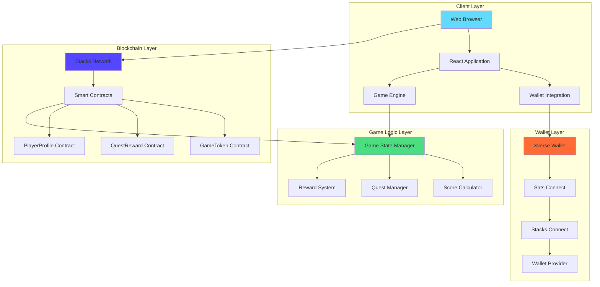
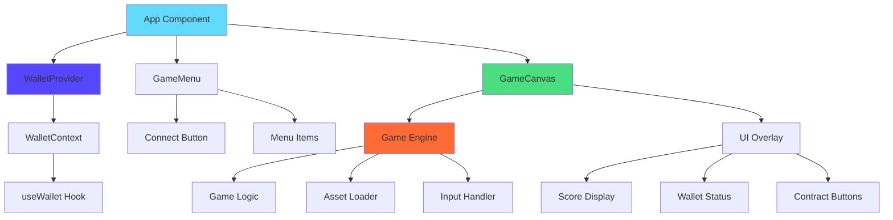
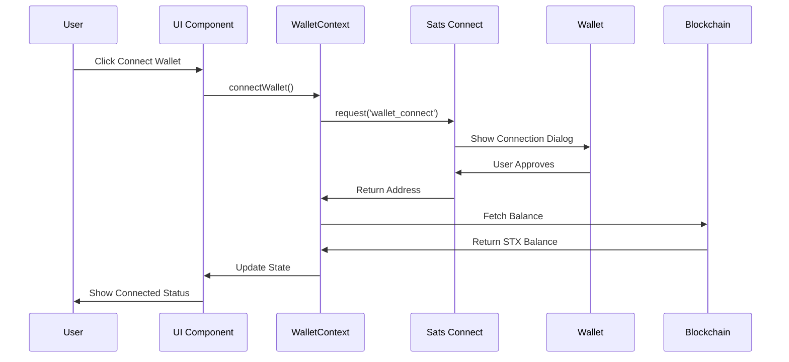
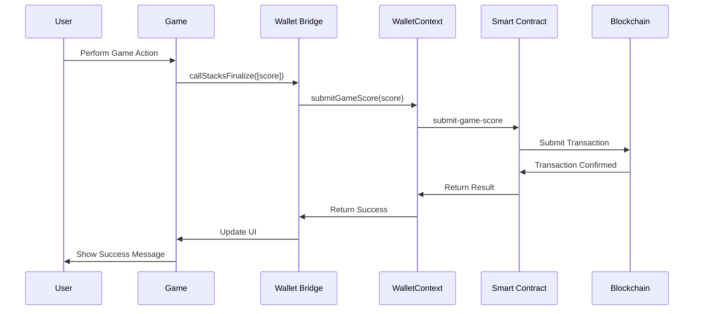
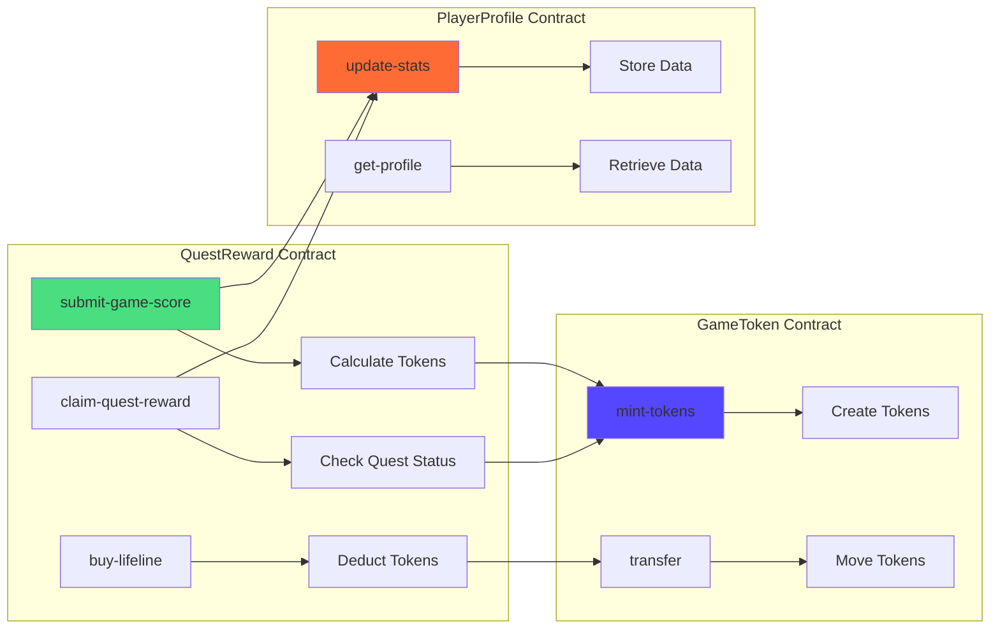
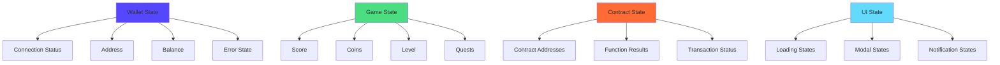
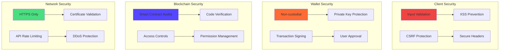
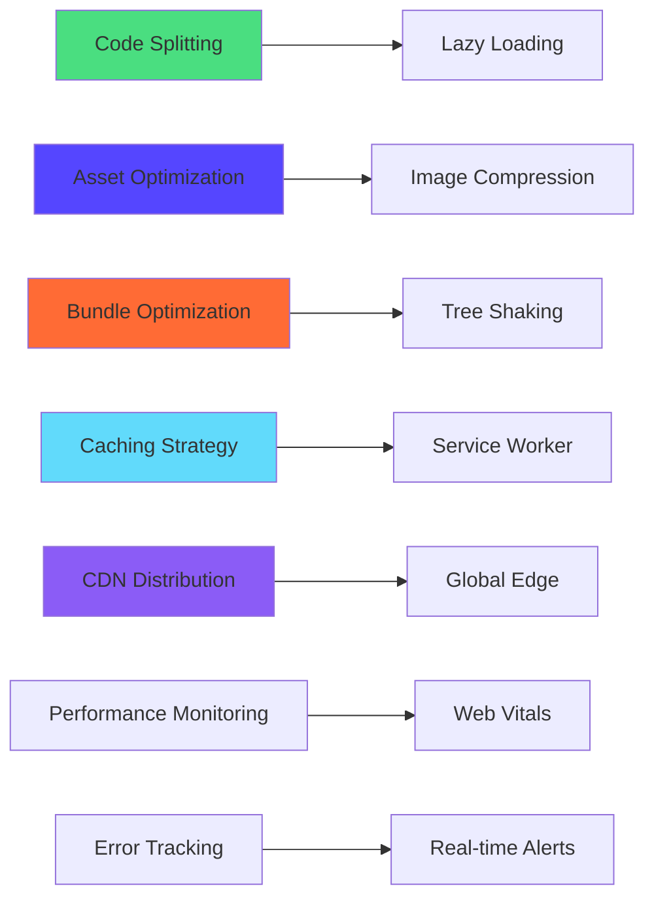
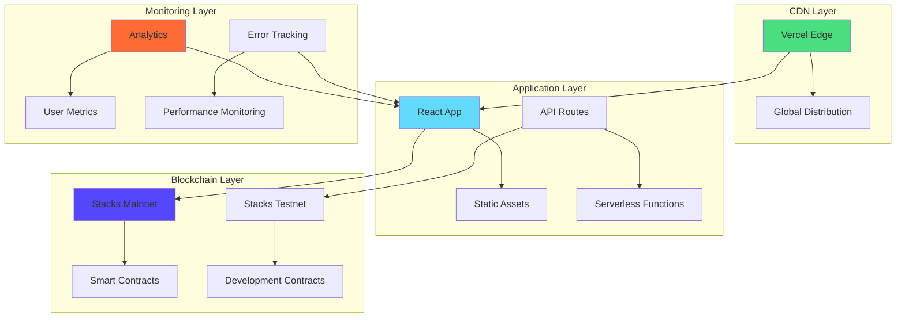

# 🎮 CoinQuest - Architecture Documentation

## System Architecture

### High-Level Architecture

### Component Architecture

## Data Flow Architecture

### Wallet Connection Flow

### Game Action Flow

## Smart Contract Architecture

### Contract Interaction Diagram

### State Management Architecture

## Security Architecture

### Security Layers

## Performance Architecture

### Optimization Strategies

## Deployment Architecture

### Production Environment

## Scalability Considerations

### Horizontal Scaling

- **Stateless Architecture**: No server-side state
- **CDN Distribution**: Global content delivery
- **Blockchain Decentralization**: Distributed contract execution
- **Wallet Integration**: Client-side wallet management

### Vertical Scaling

- **Code Optimization**: Efficient algorithms
- **Asset Optimization**: Compressed resources
- **Bundle Splitting**: Modular loading
- **Caching Strategies**: Reduced network requests

## Future Architecture Enhancements

### Planned Improvements

1. **Microservices Architecture**: Break down into smaller services
2. **GraphQL Integration**: Efficient data fetching
3. **Real-time Updates**: WebSocket connections
4. **Mobile App**: React Native implementation
5. **Cross-chain Support**: Multi-blockchain integration

### Technology Roadmap

- **Q1 2024**: Mobile app development
- **Q2 2024**: Cross-chain integration
- **Q3 2024**: Advanced analytics
- **Q4 2024**: AI-powered features
